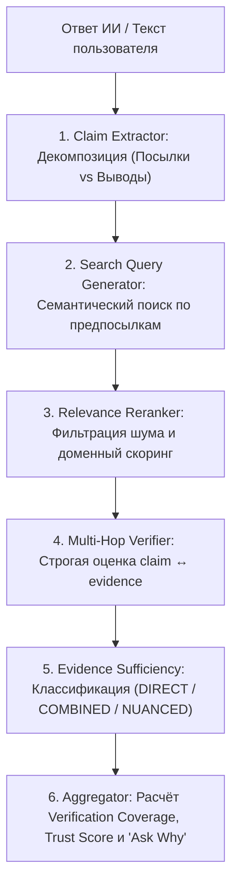

# 🛡️ SenimAI (Сенім AI) — Питч и презентация проекта
> **Хакатон кейс:** «AI Trust: можно ли доверять ответу ИИ?»  
> **Главный тезис:** *«Мы не создали ещё один ИИ, который просит вас поверить ему на слово. Мы построили независимый слой проверки между ответом ИИ и пользователем: разбили ответ на атомарные утверждения, нашли внешние доказательства (evidence) и объяснили, почему конкретной части ответа можно или нельзя доверять.»*

---

## ⚡ 1. Проблема: «Иллюзия компетентности ИИ»

Каждый день миллионы людей используют ChatGPT, Gemini, Claude для учебы, работы, аналитики и принятия решений.
ИИ формулирует ответы **уверенным, связным и авторитетным тоном**, даже когда допускает фактические ошибки или скрытые галлюцинации.

> ❌ **В чём ловушка наивного подхода?**  
> Попытка спросить другую модель: *«Правда ли то, что написал ChatGPT?»*  
> Это создаёт порочный круг: **«Спросили у ИИ, можно ли доверять ИИ»**. Если модель опирается только на свою внутреннюю память, она рискует подтвердить галлюцинацию или сгенерировать новую.

---

## 💡 2. Наше решение — SenimAI

**SenimAI — это доказательный конвейер верификации (Evidence-Based Verification Pipeline).**

### 🔑 Наш фундаментальный принцип:
> **LLM не является источником истины. LLM — это аналитический инструмент сопоставления проверяемого утверждения с независимыми внешними доказательствами.**

```text
Ответ ИИ 
   ↓
Атомарные утверждения (Claims: Посылки vs Выводы)
   ↓
Семантический поиск по предпосылкам (Multi-Hop Search)
   ↓
Сбор и реранкинг доказательств (Relevance Reranking & Source Tiers)
   ↓
Строгий анализ соответствия (Grounded Multi-Hop Verification)
   ↓
Объяснимый вердикт + Доказательная достаточность (Explainable Verdict & Evidence Sufficiency)
```

---

## ⚙️ 3. Архитектура конвейера (Pipeline)



### Ключевые этапы работы системы:

1. **Декомпозиция причинно-следственных связей (Premise vs. Deduction):**
   Сложные причинно-следственные предложения (*«A, поэтому B»*) разбиваются на **исходную посылку** и **логический вывод**. Это позволяет выявлять скрытые софизмы, когда сам факт верен, но сделанный из него вывод ложен.
2. **Multi-Hop Query Generation (Поиск по предпосылкам):**
   Система не ищет дословные совпадения длинных предложений. Она декомпозирует утверждение на атомарные технические предпосылки и ищет доказательства по официальной документации и стандартам.
3. **Семантический реранкинг и фильтрация шума (Relevance Reranker):**
   Отсекает совпадения омонимов и нерелевантные статьи, ранжируя источники по авторитетности (Tier 1: официальные спецификации, Tier 2: профильные энциклопедии).
4. **Multi-Hop верификация и доказательная достаточность (Evidence Sufficiency):**
   - **`DIRECT`** — прямое подтверждение/опровержение одним первоисточником.
   - **`COMBINED`** — логический синтез нескольких предпосылок (Multi-Hop reasoning).
   - **`NUANCED`** — фиксация терминологических тонкостей (*call by sharing*).
   - **`UNVERIFIED`** — честная фиксация недостатка данных (*«неизвестно ≠ ложь»*).
5. **Прозрачные метрики: Verification Coverage + Human Breakdown:**
   Система разделяет **покрытие верификации** (*«проверено 4 из 5 утверждений»*) и **структурированный вердикт** (*«3 опровергнуто · 5 недостаточно доказательств»*), исключая псевдоточные и вводящие в заблуждение проценты.

---

## 🔍 4. Главное отличие: почему SenimAI умнее обычного RAG и Perplexity?

```text
               ОБЫЧНЫЙ RAG / AI-ПОИСК                │                 SENIM AI PIPELINE
─────────────────────────────────────────────────────┼─────────────────────────────────────────────────────
Текст: "HTTP stateless, поэтому сервер не может      │ Текст: "HTTP stateless, поэтому сервер не может
        хранить данные между запросами"              │         хранить данные между запросами"
                                                     │
1. Находит слово "HTTP stateless"                    │ 1. Декомпозиция:
2. Видит совпадение в базе                           │    ├─ Посылка (Premise): "HTTP — stateless"
3. Считает весь ответ верным                         │    └─ Вывод (Deduction): "Сервер не может хранить данные"
                                                     │
                                                     │ 2. Независимая проверка каждого звена:
                                                     │    ├─ Посылка ➔ 🟢 SUPPORTED [DIRECT]
                                                     │    └─ Вывод ➔ 🔴 CONTRADICTED [DIRECT] (cookies/DB)
                                                     │
❌ ОШИБКА: Пропуск ложного вывода                    │ 🎯 ВЕРДИКТ: "Частично верно: посылка верна, но вывод ложен"
```

---

## 📊 5. Сравнение подходов

| Параметр | Стандартный подход / Обычный RAG | **SenimAI Pipeline** |
|---|---|---|
| **Источник фактов** | Внутренняя память модели / поисковый топ | **Независимые внешние первоисточники (Tier 1/2)** |
| **Анализ логики** | Оценка предложения целиком (риск софизмов) | **Разделение на посылку и следствие (Premise vs Deduction)** |
| **Сложные выводы** | Поиск дословного текста в сети | **Multi-Hop логический синтез доказательств (`COMBINED`)** |
| **Тонкие нюансы** | Игнорирование или грубый True/False | **Класс `NUANCED` с фиксацией контекста** |
| **Недостаток данных** | Склонность к домысливанию и галлюцинациям | **Строгий статус `UNVERIFIED` (Insufficient Evidence)** |
| **Метрики** | Размытые псевдоточные проценты | **Честный человеческий breakdown (Confirmed · Contradicted · Insufficient)** |
| **Безопасность** | Риск prompt injection из сниппетов | **Изоляция веб-контента как недоверенных данных** |
| **Демо-надежность** | Зависимость от внешних сетей | **Встроенный оффлайн-режим (Mock Mode) для защиты демо** |

---

## 🎬 6. Сценарии для Live Demo на защите

### 💎 Демо 1 (Главный акцент): «Логическая подмена и софизм» (Premise vs Deduction)
> **Входной текст:** *«HTTP является протоколом без состояния, поэтому сервер не может хранить информацию о предыдущих запросах клиента между HTTP-запросами.»*  
> **Результат анализа SenimAI:**
> ```text
> Исходное утверждение
>         │
>         ├── 🟢 SUPPORTED [DIRECT]: «HTTP является протоколом без состояния (stateless)»
>         │
>         └── 🔴 CONTRADICTED [DIRECT]: «Сервер не может хранить состояние между запросами»
>                     │
>                     ↓
>              ❌ Ошибочная причинно-следственная связь (сервер хранит сессии, cookies, Redis)
> ```
> **Итог:** 🟡 **Частично ложно** | Coverage: `2/2 утверждений проверено` | Evidence Confidence: `High`  
> 🎯 **Что это доказывает жюри:** Обычный AI пропускает эту ошибку, потому что слово *stateless* истинно. SenimAI доказывает, что вывод неверен, и спасает пользователя от критической ошибки.

---

### 🔥 Демо 2: «Concurrency Multi-Hop: связываем поиск с логикой»
> **Входной текст:** *«Модуль asyncio в Python позволяет выполнять несколько CPU-bound задач параллельно в одном потоке.»*  
> **Результат анализа SenimAI:**
> - Источники: *Python docs: asyncio uses a single-threaded cooperative event loop; tasks yield via await*.
> - Логический вывод (Multi-Hop): *В одном потоке кооперативное переключение не обеспечивает параллельного выполнения CPU-задач; длительные вычисления блокируют event loop*.
> - Вердикт: 🔴 **`CONTRADICTED`** `[COMBINED: Multi-Hop Deduction]`
> 
> 🎯 **Что это доказывает жюри:** Senim не останавливается на `UNVERIFIED`, когда нет дословной цитаты «CPU-bound нельзя параллельно», а синтезирует механизм работы и логически опровергает тезис.

---

### 🌟 Демо 3: «Техническая точность: Identity vs Equality (`is` vs `==`)»
> **Входной текст:** *«В Python оператор is сравнивает объекты на равенство значений, а кортежи являются изменяемыми объектами.»*  
> **Результат анализа SenimAI:**
> - 🔴 *«is сравнивает объекты на равенство»* ➔ **`CONTRADICTED`** (сравнение identity/адресов памяти, а не значений `==`)
> - 🔴 *«кортежи являются изменяемыми»* ➔ **`CONTRADICTED`** (кортежи — immutable sequences)
> 
> 🎯 **Пояснение для жюри:** Система находит точные цитаты из спецификаций Python Data Model, полностью исключая галлюцинации.

---

## 🛡️ 7. Ответы на вопросы жюри (Q&A Cheat Sheet)

### ❓ В: *«Вы используете LLM для проверки. Что если ваша модель тоже ошибётся?»*
> 🎯 **О:** «Мы используем LLM не как источник фактов, а как компаратор между утверждением и найденными внешними evidence. Модели запрещено отвечать 'по памяти'. Если найденных доказательств недостаточно, система возвращает `UNVERIFIED` вместо того, чтобы додумывать информацию.»

### ❓ В: *«А кто проверяет ваши источники? Что если статья в интернете содержит неправду?»*
> 🎯 **О:** «SenimAI не объявляет найденный источник абсолютной истиной. Мы предоставляем пользователю прозрачность: показываем сам источник, оцениваем его авторитетность по эвристикам доменов (`.gov`, `.edu`, официальные реестры, энциклопедии) и сопоставляем несколько источников. Если они расходятся, система не делает слепой выбор, а возвращает статус `CONFLICTING`.»

### ❓ В: *«А если найденный веб-контент содержит prompt injection?»*
> 🎯 **О:** «Найденный веб-контент проходит через Security Layer и изолируется от системных инструкций. Любые содержащиеся в сниппетах директивы обрабатываются моделью исключительно как пассивные данные для анализа фактов.»

### ❓ В: *«Почему вы отказались от абстрактного единого процента доверия (Trust Score)?»*
> 🎯 **О:** «Единый процент (например, '0%' или '50%') вводит пользователя в заблуждение: 0% воспринимается как 'весь текст полностью ложен', хотя на самом деле часть утверждений опровергнута, а по части просто не хватило доказательств в открытых источниках. Мы выводим прозрачный результат: `3 опровергнуто · 5 недостаточно доказательств` и покрытие проверки `3/8`. Это честно и понятно пользователю.»

---

## 💼 8. Применение и продуктовое развитие

1. **Enterprise LLM Guardrails (B2B):**
   Автоматическая валидация ответов RAG-систем (банки, юридические и медицинские ассистенты) перед выдачей пользователю.
2. **Browser Extension & AI Plugins (B2C):**
   Кнопка мгновенной проверки достоверности в интерфейсах ChatGPT, Claude и веб-страницах.
3. **Fact-Checking Hub для EdTech и медиа:**
   Инструмент фактчекинга для аналитиков, журналистов и проверки академических работ.

---

## 🚀 9. Быстрый запуск

```bash
docker compose up --build
```
- **Backend API & Swagger:** `http://localhost:8000/docs`
- **Frontend Web UI:** `http://localhost:3000`
- **Тестовый набор:** `pytest backend/tests` (19 passed)

---
*Команда SenimAI — Хакатон 2026*
