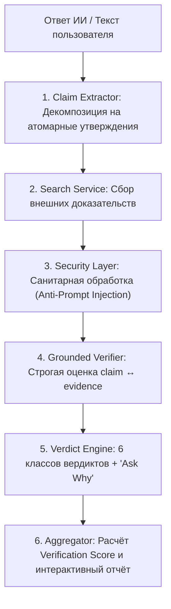

# 🛡️ SenimAI (Сенім AI) — Питч и презентация проекта
> **Хакатон кейс:** «AI Trust: можно ли доверять ответу ИИ?»  
> **Главный тезис:** *«Мы не создали ещё один ИИ, который просит вас поверить ему на слово. Мы построили независимый слой проверки между ответом ИИ и пользователем: разбили ответ на атомарные утверждения, нашли внешние доказательства (evidence) и объяснили, почему конкретной части ответа можно или нельзя доверять.»*

---

## ⚡ 1. Проблема: «Иллюзия компетентности ИИ»

Каждый день миллионы людей используют ChatGPT, Gemini, Claude для учебы, работы, аналитики и принятия решений.
ИИ формулирует ответы **уверенным, связным и авторитетным тоном**, даже когда допускает фактические ошибки или скрытые галлюцинации.

> ❌ **В чём ловушка наивного подхода?**  
> Попытка спросить другую модель: *«Правда ли то, что написал ChatGPT?»*  
> Это создаёт порочный круг: **«Спросили у ИИ, можно ли доверять ИИ»**. Если модель опирается только на свою внутреннюю память, она рискует подтвердить галлюцинацию или сгенерировать новую.

---

## 💡 2. Наше решение — SenimAI

**SenimAI — это доказательный конвейер верификации (Evidence-Based Verification Pipeline).**

### 🔑 Наш фундаментальный принцип:
> **LLM не является источником истины. LLM — это аналитический инструмент сопоставления проверяемого утверждения с независимыми внешними доказательствами.**

```text
Ответ ИИ 
   ↓
Атомарные утверждения (Claims)
   ↓
Внешний веб-поиск (External Search)
   ↓
Сбор доказательств (Evidence Collection)
   ↓
Анализ соответствия (Grounded Verification)
   ↓
Объяснимый вердикт + Источники (Explainable Verdict & Sources)
```

---

## ⚙️ 3. Архитектура конвейера (Pipeline)



### Этапы работы системы:

1. **Декомпозиция на Claims (Claim Extraction):**
   Сложный ответ ИИ не оценивается абстрактным `TRUE/FALSE`. Он разбивается на независимые кванты информации (фактические, числовые, временные, сравнительные, мнения).
2. **Сбор внешних доказательств (Evidence Retrieval):**
   Система формирует поисковые запросы с учетом временных маркеров и контекста, опрашивая внешние источники.
3. **Security Layer (Защита от Prompt Injection):**
   Найденный веб-контент рассматривается исключительно как **недоверенные данные**, а не как инструкции для модели.
4. **Строгая верификация (Grounded Verification):**
   Модели запрещено использовать внутренние предположения. Оценка строится исключительно на базе найденных фрагментов.
   - Нет доказательств ➔ **`UNVERIFIED`** (неизвестно ≠ ложь).
   - Источники противоречат ➔ **`CONFLICTING`**.
   - Часть подтверждена ➔ **`PARTIALLY_SUPPORTED`**.
5. **Объяснимость «Ask Why» и цитирование:**
   Каждый вердикт сопровождается фрагментом найденного источника, позицией источника (`SUPPORTS`/`CONTRADICTS`), оценкой авторитетности домена и пошаговой логикой вывода.

---

## 🔍 4. Почему SenimAI прозрачен и ему можно доверять?

```text
               ПРОЗРАЧНОСТЬ SENIMAI
                        │
  ┌─────────────────────┼─────────────────────┐
  ▼                     ▼                     ▼
1. Изоляция claims    2. Внешние evidence   3. Открытые источники
Каждое утверждение    Факты берутся не      Пользователь видит
проверяется отдельно  из памяти модели      ссылки и сниппеты
  │                     │                     │
  ▼                     ▼                     ▼
4. Честность          5. Неизвестно ≠ Ложь  6. Объяснение «Почему»
Конфликты данных      Если данных нет —     Пошаговый разбор
не скрываются         статус UNVERIFIED     логики для каждого claim
```

---

## 📊 5. Сравнение подходов

| Параметр | Стандартный подход с LLM | **SenimAI Pipeline** |
|---|---|---|
| **Источник фактов** | Внутренняя память модели (параметрические знания) | **Независимые внешние доказательства в реальном времени** |
| **Гранулярность проверки** | Обобщённая оценка всего ответа целиком | **Поатомная проверка каждого отдельного утверждения** |
| **Частичные ошибки** | Теряются в общем объёме текста | **Точная локализация: что подтверждено, а что нет** |
| **Недостаток данных** | Склонность к домысливанию и галлюцинациям | **Строгий статус `UNVERIFIED`** |
| **Противоречия в данных** | Случайный выбор одной из сторон | **Статус `CONFLICTING` с демонстрацией обеих позиций** |
| **Безопасность сниппетов** | Риск выполнения скрытых prompt-инъекций | **Изоляция веб-контента как пассивных текстовых данных** |
| **Демо-надежность** | Зависимость от внешних сетей | **Встроенный оффлайн-режим (Mock Mode) для защиты демо** |

---

## 🎬 6. Сценарии для Live Demo на защите

### 💎 Демо 1 (Главный акцент): «Правдоподобная полуправда» — сила атомарной проверки
> **Входной текст:** *«Эйфелева башня была построена в 1889 году и находится в Лондоне.»*  
> **Результат анализа:**
> - Утверждение 1: *«была построена в 1889 году»* ➔ 🟢 **`SUPPORTED`** (источники подтверждают дату)
> - Утверждение 2: *«находится в Лондоне»* ➔ 🔴 **`CONTRADICTED`** (Париж, Франция)
> 
> 🎯 **Что это доказывает жюри:** Вместо бинарной оценки всего ответа SenimAI показывает, какая конкретно часть утверждения подтверждена, а какая опровергнута.

---

### 🔥 Демо 2: Комплексный ответ с разными типами фактов
> **Входной текст:**  
> *«Python был создан Гвидо ван Россумом в 1991 году. Это самый популярный язык для любых задач. Первая версия называлась Python 0.9.0 и вышла в Лондоне.»*  
> **Результат анализа:**
> - 🟢 *«создан Гвидо ван Россумом»* ➔ **`SUPPORTED`** (документация python.org)
> - 🟢 *«выпущен в 1991 году»* ➔ **`SUPPORTED`** (архивы релизов)
> - 🟣 *«самый популярный язык для любых задач»* ➔ **`NOT_FACT_CHECKABLE`** (субъективное мнение)
> - ⚪ *«вышла в Лондоне»* ➔ **`UNVERIFIED`** / **`CONTRADICTED`** (CWI, Нидерланды)
> 
> 🎯 **Что это доказывает жюри:** Система корректно отделяет субъективные мнения от проверяемых фактов и независимо оценивает каждый пункт.

---

### 🌟 Демо 3: Корректный ответ без ложных срабатываний
> **Входной текст:** *«Python был разработан в Нидерландах и опубликован в феврале 1991 года.»*  
> **Результат:** 🟢 **`SUPPORTED`** (`Verification Score: 100%`).  
> 
> 🎯 **Пояснение для жюри:** `Verification Score` — это не «вероятность абсолютной истины», а показатель того, какая доля утверждений получила надёжные подтверждающие доказательства в найденных источниках.

---

## 🛡️ 7. Ответы на вопросы жюри (Q&A Cheat Sheet)

### ❓ В: *«Вы используете LLM для проверки. Что если ваша модель тоже ошибётся?»*
> 🎯 **О:** «Мы используем LLM не как источник фактов, а как компаратор между утверждением и найденными внешними evidence. Модели запрещено отвечать 'по памяти'. Если найденных доказательств недостаточно, система возвращает `UNVERIFIED` вместо того, чтобы додумывать информацию.»

### ❓ В: *«А кто проверяет ваши источники? Что если статья в интернете содержит неправду?»*
> 🎯 **О:** «SenimAI не объявляет найденный источник абсолютной истиной. Мы предоставляем пользователю прозрачность: показываем сам источник, оцениваем его авторитетность по эвристикам доменов (`.gov`, `.edu`, официальные реестры, энциклопедии) и сопоставляем несколько источников. Если они расходятся, система не делает слепой выбор, а возвращает статус `CONFLICTING`.»

### ❓ В: *«А если найденный веб-контент содержит prompt injection?»*
> 🎯 **О:** «Найденный веб-контент проходит через Security Layer и изолируется от системных инструкций. Любые содержащиеся в сниппетах директивы обрабатываются моделью исключительно как пассивные данные для анализа фактов.»

### ❓ В: *«Что означает ваш Verification Score?»*
> 🎯 **О:** «Это агрегированный показатель доказательного покрытия: какая доля утверждений подкреплена внешними источниками, а какая требует внимания или перепроверки. Пользователь всегда может раскрыть отчёт и увидеть детальный breakdown по каждому claim.»

---

## 💼 8. Применение и продуктовое развитие

1. **Enterprise LLM Guardrails (B2B):**
   Автоматическая валидация ответов RAG-систем (банки, юридические и медицинские ассистенты) перед выдачей пользователю.
2. **Browser Extension & AI Plugins (B2C):**
   Кнопка мгновенной проверки достоверности в интерфейсах ChatGPT, Claude и веб-страницах.
3. **Fact-Checking Hub для EdTech и медиа:**
   Инструмент фактчекинга для аналитиков, журналистов и проверки академических работ.

---

## 🚀 9. Быстрый запуск

```bash
docker compose up --build
```
- **Backend API & Swagger:** `http://localhost:8000/docs`
- **Frontend Web UI:** `http://localhost:3000`
- **Тестовый набор:** `pytest backend/tests` (19 passed)

---
*Команда SenimAI — Хакатон 2026*
