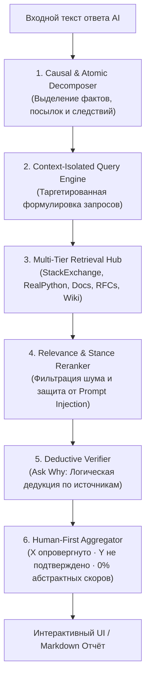

# 🛡️ SenimAI

> **Evidence-Based Fact-Checking & Causal Verification Engine for AI Generated Responses**  
> *«Сенім» (каз.) — доверие, убеждённость.*

[](#тестирование)
[](https://python.org)
[](https://fastapi.tiangolo.com)
[](LICENSE)

---

## 📌 В чём проблема?

Современные языковые модели (LLM) формулируют ответы уверенным, профессиональным тоном. Однако при решении технических, юридических или фактологических задач возникает критическая уязвимость: **«Смешение правды и скрытого вымысла»**.

1. **Иллюзия достоверности:** Ответ может содержать 8 истинных вводных фактов и всего 1 критическую логическую ошибку в выводе.
2. **Ложные причинно-следственные связи (Causal Fallacies):** Например, *«HTTP — stateless-протокол, поэтому сервер в принципе не может сохранять состояние сессии пользователя»*. Первая часть верна, вторая — ложный вывод.
3. **Проблема абстрактных процентов («Trust Score Lie»):** Если классификатор выставляет тексту оценку `88% trust score`, для пользователя это выглядит как «в целом надёжно». Но если оставшиеся 12% — это фатальная уязвимость в SQL-запросе или искажённое поведение оператора `is` в Python, цена такой «оценки» катастрофична.

**SenimAI решает эту проблему по принципу доказательной юриспруденции:** утверждение считается проверенным не потому, что LLM «так считает», а только если оно декомпозировано на атомарные посылки и подтверждено независимыми первоисточниками (RFC, официальная документация, профильные базы знаний).

---

## 🏗️ Архитектура пайплайна



---

## ⚙️ Ключевые компоненты системы

### 1. Атомарная и причинно-следственная декомпозиция
Вместо оценки текста целиком SenimAI разбивает сложный абзац на независимые проверяемые единицы (`Claim`), определяя их причинно-следственную роль (`STANDALONE`, `PREMISE`, `CONCLUSION`):
- **Фактологические** (`factual`)
- **Числовые** (`numerical`)
- **Временные** (`temporal`)
- **Сравнительные** (`comparative`)
- **Субъективные мнения** (`opinion` — автоматически помечаются как `NOT_FACT_CHECKABLE`, экономя поисковые ресурсы)

### 2. Изолированный таргетированный поиск (No Context Contamination)
Поисковый модуль не загрязняет запросы текущего утверждения ключевыми словами из предыдущего контекста:
- **PostgreSQL LIKE/B-Tree** ищет спецификации индексов только если в самом утверждении фигурирует поиск по маске.
- **Python Data Model** разделяет проверку идентичности (`is`), кеширования малых чисел CPython (`-5..256`) и передачи аргументов по ссылке.
- **HTTP / Web** адресует запросы к спецификациям IETF RFC и MDN Web Docs.

### 3. Многоуровневый провайдер доказательств (Multi-Tier Retrieval)
Параллельный опрос доверенных источников первого и второго эшелона:
| Источник | Область покрытия | Степень доверия |
| :--- | :--- | :--- |
| **IETF RFC / W3C / ISO** | Сетевые протоколы, стандарты HTTP, Web | `HIGH (Tier 1)` |
| **docs.python.org / postgresql.org** | Официальные спецификации языков и СУБД | `HIGH (Tier 1)` |
| **StackExchange API (StackOverflow, DBA)** | Реальные разборы механизмов и corner-cases | `HIGH (Tier 1)` |
| **RealPython / GeeksForGeeks** | Профильные технические разборы и туториалы | `HIGH (Tier 1)` |
| **MediaWiki API (EN & RU Wikipedia)** | Общие энциклопедические и исторические факты | `MEDIUM (Tier 2)` |

### 4. Доказательная достаточность (Evidence Sufficiency)
Для каждого утверждения верификатор фиксирует степень полноты доказательной базы:
- `DIRECT` — источник прямо подтверждает или опровергает утверждение без промежуточных допущений.
- `COMBINED` — вывод следует из логической связки двух или более независимых фактов (Multi-Hop Deduction).
- `INDIRECT` — источник даёт косвенный контекст, но прямой вывод требует экстраполяции.
- `INSUFFICIENT` — надёжных свидетельств не найдено (статус `UNVERIFIED`).

### 5. Защита от Prompt Injection в сниппетах
Веб-сниппеты и внешний контент размечаются в системных инструкциях строго как **данные для анализа**, а не как управляющие команды. Любые инструкции, найденные на внешних сайтах, нейтрализуются.

### 6. Честный итог вместо абстрактного процента
SenimAI принципиально не использует формулы вроде «73% правды». Итоговая сводка отображает:
- **Результат:** `2 contradicted · 1 partially supported`
- **Охват доказательствами:** `3/4 проверено`
- **Индивидуальную карту доказательств** для каждого фрагмента исходного текста.

---

## 🧪 Реальные тестовые кейсы (Benchmarks)

### Кейс 1: Python `is` vs `==`
- **Утверждение AI:** *«Оператор `is` в Python сравнивает значения объектов, а не их адреса в памяти.»*
- **Найденные источники:** `docs.python.org` (Data Model Expressions), `realpython.com` (`is` vs `==`).
- **Вердикт SenimAI:** 🔴 `CONTRADICTED` `[DIRECT]`.
- **Ask Why:** 
  1. *Премисса 1:* `is` проверяет идентичность объектов через сравнение `id(a) == id(b)`.
  2. *Премисса 2:* Для сравнения значений объектов предназначен оператор `==` (`__eq__`).
  3. *Вывод:* Утверждение ложно, так как перепутало назначение операторов.

### Кейс 2: PostgreSQL B-tree и префикс `LIKE '%pattern'`
- **Утверждение AI:** *«В PostgreSQL индекс B-tree ускоряет любые запросы с оператором LIKE, даже если шаблон начинается с `%`»*
- **Найденные источники:** `postgresql.org/docs` (Indexes Types), `dba.stackexchange.com`.
- **Вердикт SenimAI:** 🔴 `CONTRADICTED` `[DIRECT]`.
- **Ask Why:** Стандартный B-tree индекс оптимизирует поиск только с константным левым префиксом (`col LIKE 'foo%'`). При наличии ведущего `%` индексный скан невозможен (требуется GIN с расширением `pg_trgm`).

### Кейс 3: HTTP Stateless и сессии
- **Утверждение AI:** *«HTTP является stateless-протоколом, поэтому сервер не может сохранять состояние сессии.»*
- **Найденные источники:** `ietf.org` (RFC 9110), `developer.mozilla.org` (HTTP Overview).
- **Вердикт SenimAI:** 🟡 `PARTIALLY_SUPPORTED` `[COMBINED]`.
- **Ask Why:** Первая часть верна (протокол не сохраняет состояние между соединениями), но вывод ошибочен: сессионное состояние сохраняется на уровне приложения с помощью Cookies, токенов и внешних хранилищ (Redis/DB).

---

## 🚀 Быстрый старт

### Вариант 1: Запуск через Docker Compose (Рекомендуется)

```bash
# Клонирование репозитория
git clone https://github.com/fenzit/SenimAI.git
cd SenimAI

# Запуск бэкенда и фронтенда
docker compose up --build
```

- **Frontend UI:** [http://localhost:3000](http://localhost:3000)
- **Backend API:** [http://localhost:8000](http://localhost:8000)
- **Swagger / OpenAPI:** [http://localhost:8000/docs](http://localhost:8000/docs)

---

### Вариант 2: Локальная разработка

#### 1. Backend (FastAPI)

```bash
cd backend
python -m venv .venv
# Активация окружения (Windows: .venv\Scripts\activate | Linux/macOS: source .venv/bin/activate)
pip install -r requirements.txt

# Настройка переменных
cp .env.example .env

# Запуск сервера
uvicorn app.main:app --reload --port 8000
```

#### 2. Frontend (React + Vite)

```bash
cd frontend
npm install
npm run dev
```

---

## 🔧 Конфигурация окружения (`.env`)

| Переменная | По умолчанию | Описание |
| :--- | :--- | :--- |
| `MOCK_MODE` | `false` | Если `true`, сервис работает полностью оффлайн на демонстрационных фикстурах |
| `GEMINI_API_KEY` | `""` | API ключ Google Gemini (Flash / Pro) |
| `GEMINI_MODEL` | `gemini-3.5-flash-lite` | Рабочая модель Gemini (`gemini-3.5-flash-lite`, `gemini-3.5-flash`, `gemini-flash-latest`) |
| `OPENAI_API_KEY` | `""` | API ключ OpenAI / OpenRouter / DeepSeek |
| `OPENAI_BASE_URL` | `https://api.openai.com/v1` | URL OpenAI-совместимого эндпоинта (Ollama / vLLM / Groq) |
| `SEARCH_PROVIDER` | `duckduckgo` | Основной веб-поисковик (`duckduckgo`, `tavily`, `serper`, `wikipedia`) |
| `TAVILY_API_KEY` | `""` | API ключ Tavily Search (опционально) |
| `MAX_CLAIMS` | `8` | Лимит утверждений для одного анализа |
| `MAX_CONCURRENT_CLAIMS` | `4` | Количество параллельных воркеров верификации |

---

## 📡 Спецификация API

### `POST /api/v1/analyze`
Выполняет полный пайплайн: извлечение утверждений, параллельный поиск доказательств и логическую верификацию.

**Тело запроса:**
```json
{
  "text": "Оператор is в Python сравнивает значения объектов, а не их id.",
  "language": "ru",
  "max_claims": 8
}
```

**Ответ:**
```json
{
  "analysis_id": "analysis_73842b52c510",
  "processing_time_ms": 1420,
  "summary": {
    "total_claims": 1,
    "supported": 0,
    "contradicted": 1,
    "partially_supported": 0,
    "unverified": 0,
    "not_fact_checkable": 0,
    "conflicting": 0,
    "verification_errors": 0,
    "verified_claims_count": 1,
    "overall_verdict": "CONTRADICTED",
    "summary_line": "1 contradicted",
    "evidence_status": "CONTRADICTED",
    "evidence_confidence_label": "High"
  },
  "claims": [
    {
      "id": 1,
      "text": "Оператор is в Python сравнивает значения объектов, а не их id.",
      "type": "factual",
      "verdict": "CONTRADICTED",
      "confidence": 0.98,
      "evidence_sufficiency": "DIRECT",
      "causal_role": "STANDALONE",
      "explanation": "Оператор 'is' проверяет идентичность объектов в памяти (id), тогда как значения сравниваются оператором '=='.",
      "why_verdict": "Премисса 1: 'is' сравнивает id в памяти. Премисса 2: '==' сравнивает значения через __eq__. Вывод: утверждение прямо противоречит спецификации языка.",
      "sources": [
        {
          "title": "Python 'is' vs '==': Comparing Objects in Python",
          "url": "https://realpython.com/python-is-identity-vs-equality/",
          "domain": "realpython.com",
          "quality": "HIGH",
          "stance": "CONTRADICTS",
          "relevance": "DIRECT",
          "snippet": "The '==' operator compares the values of two objects. The 'is' operator compares the identities of two objects..."
        }
      ]
    }
  ]
}
```

### `POST /api/v1/export/markdown`
Генерирует форматированный Markdown-отчёт для сохранения и шеринга результатов анализа.

---

## 🧪 Тестирование

Все ключевые компоненты покрыты изолированными тестами (моделирование, фикстуры, скоринг, защита от инъекций):

```bash
cd backend
python -m pytest tests/ -v
```

```text
tests/test_api.py::test_root_endpoint PASSED [ 5%]
tests/test_api.py::test_health_endpoint PASSED [ 10%]
tests/test_api.py::test_demo_cases_endpoint PASSED [ 15%]
tests/test_api.py::test_analyze_empty_text PASSED [ 21%]
tests/test_api.py::test_analyze_mock_mode PASSED [ 26%]
tests/test_api.py::test_export_markdown PASSED [ 31%]
tests/test_claim_extraction.py::test_claim_extraction_with_mock PASSED [ 36%]
tests/test_claim_extraction.py::test_fallback_claim_extraction PASSED [ 42%]
tests/test_fixtures.py::test_fixtures_load[fully_correct] PASSED [ 47%]
tests/test_fixtures.py::test_fixtures_load[obvious_hallucination] PASSED [ 52%]
tests/test_fixtures.py::test_fixtures_load[partially_correct] PASSED [ 57%]
tests/test_fixtures.py::test_fixtures_load[opinion] PASSED [ 63%]
tests/test_fixtures.py::test_fixtures_load[conflicting_sources] PASSED [ 68%]
tests/test_fixtures.py::test_fixtures_load[temporal_claim] PASSED [ 73%]
tests/test_fixtures.py::test_mock_analyzer_on_fixtures PASSED [ 78%]
tests/test_verifier.py::test_opinion_claim_is_not_fact_checkable PASSED [ 84%]
tests/test_verifier.py::test_empty_sources_yields_unverified PASSED [ 89%]
tests/test_verifier.py::test_verifier_with_evidence PASSED [ 94%]
tests/test_verifier.py::test_aggregator_score_calculation PASSED [100%]

======================== 19 passed in 0.47s ========================
```

---

## 👥 Команда & Хакатон

Проект разработан для участия в хакатоне **WIT Teens Challenge**.

*SenimAI — проверяйте факты, а не доверяйте слепо генерации.*
